# Database schema — key relationships

Generated 8/17/26 from a live query against `information_schema` — every
primary and foreign key constraint actually enforced in Postgres, not
inferred from folder structure or file contents. See
`docs/patch_list.md` #4 for how the underlying `schema_migrations`
inventory (46 deployed objects) was built.

```mermaid
erDiagram
  PLAYERS ||--o{ GAME_LOGS : player_id
  TEAMS ||--o{ GAME_LOGS : team_id
  TEAMS ||--o{ GAME_LOGS : opponent_team_id
  PLAYERS ||--o{ GAP_REASONS : player_id
  TEAMS ||--o{ GAP_REASONS : team_id
  TEAMS ||--o{ TEAM_SCHEDULE : team_id
  TEAMS ||--o{ TEAM_SCHEDULE : opponent_team_id
  PLAYERS ||--o{ SLEEPER_PLAYER_CROSSWALK : nba_player_id
  SLEEPER_LEAGUES ||--o{ SLEEPER_MATCHUPS : league_id
  SLEEPER_LEAGUES ||--o{ SLEEPER_ROSTERS : league_id
  SLEEPER_LEAGUES ||--o{ SLEEPER_TRANSACTIONS : league_id
  SLEEPER_LEAGUES ||--o{ SLEEPER_USERS : league_id

  PLAYERS {
    int player_id PK
  }
  TEAMS {
    int team_id PK
  }
  GAME_LOGS {
    string game_id PK
    int player_id PK
    int team_id FK
    int opponent_team_id FK
  }
  GAP_REASONS {
    string game_id PK
    int player_id PK
    int team_id FK
  }
  TEAM_SCHEDULE {
    int team_id PK
    string game_id PK
    int opponent_team_id FK
  }
  TEAM_GAME_STATS {
    string game_id PK
    int team_id PK
  }
  GAME_FANTASY_SCORES_WEEKLY_EFFECTIVE {
    string game_id PK
    int player_id PK
  }
  FANTASY_WEEKS {
    int week_number PK
    string season_id PK
  }
  HOLD_VALUE_CURVE_PARAMS_BY_TIER {
    string tier PK
  }
  SCHEMA_MIGRATIONS {
    string filename PK
  }
  SLEEPER_LEAGUES {
    string league_id PK
  }
  SLEEPER_MATCHUPS {
    int week PK
    int roster_id PK
    string league_id "PK, FK"
  }
  SLEEPER_ROSTERS {
    int roster_id PK
    string league_id "PK, FK"
  }
  SLEEPER_TRANSACTIONS {
    string transaction_id PK
    string league_id FK
  }
  SLEEPER_USERS {
    string user_id PK
    string league_id "PK, FK"
  }
  SLEEPER_PLAYER_CROSSWALK {
    string sleeper_player_id PK
    int nba_player_id FK
  }
  SLEEPER_MATCHUP_POINTS_SNAPSHOTS {
    string league_id PK
    timestamp synced_at PK
    int roster_id PK
    int week PK
  }
  STAFF {
    int id PK
  }
```



## What this does and doesn't show

- **Columns shown are PK/FK only**, not full table definitions — every
  table here has more columns than drawn; this diagram exists to show
  relationships and keys, not a full data dictionary.
- **No line ≠ no relationship** — several tables carry no FK constraint
  even where a real relationship exists in practice:
  `game_fantasy_scores_weekly_effective` almost certainly relates to
  `game_logs` by `(game_id, player_id)`, `team_game_stats` plausibly
  relates to `teams`/`game_logs` — neither is enforced at the DB level.
  `fantasy_weeks`, `hold_value_curve_params_by_tier`,
  `schema_migrations`, and `staff` are genuinely standalone, no FK
  either way.
- **`sleeper_matchup_points_snapshots` has no FK to `sleeper_leagues`**
  despite carrying a `league_id` column — worth tightening if the table
  ever needs referential integrity enforced rather than just assumed.
- **Views are not shown.** Postgres views (`player_tiers`,
  `game_lock_signal`, `historical_matchup_results`, `ownable_player_pool`,
  and ~27 others — see `schema_migrations` for the full deployed list)
  don't carry physical FK constraints, so `information_schema` can't see
  them. They sit logically downstream of the tables above, joined via
  each view's own `JOIN` clauses rather than enforced keys.

## Regenerating this

```bash
psql postgres -c "
SELECT
    tc.table_name,
    tc.constraint_type,
    kcu.column_name,
    ccu.table_name AS references_table,
    ccu.column_name AS references_column
FROM information_schema.table_constraints tc
JOIN information_schema.key_column_usage kcu
    ON tc.constraint_name = kcu.constraint_name
LEFT JOIN information_schema.constraint_column_usage ccu
    ON tc.constraint_name = ccu.constraint_name
    AND tc.constraint_type = 'FOREIGN KEY'
WHERE tc.constraint_type IN ('PRIMARY KEY', 'FOREIGN KEY')
  AND tc.table_name IN (
    'fantasy_weeks', 'game_fantasy_scores_weekly_effective', 'game_logs',
    'gap_reasons', 'hold_value_curve_params_by_tier', 'players',
    'schema_migrations', 'sleeper_leagues', 'sleeper_matchup_points_snapshots',
    'sleeper_matchups', 'sleeper_player_crosswalk', 'sleeper_rosters',
    'sleeper_transactions', 'sleeper_users', 'staff', 'team_game_stats',
    'team_schedule', 'teams'
  )
ORDER BY tc.table_name, tc.constraint_type DESC;
"
```

The table list in the `IN (...)` clause is the live `\dt` inventory as
of 8/17/26 — update it if new tables are added, or the diagram will
silently miss them.
