# two_words — Schema Relationship Diagram (Step 7)

## 1. Full Project Relationship Diagram (primary)

This is the real picture: core lock/hold engine + Sleeper integration,
tables and views together. The project's 3NF rule (raw stats only in
tables, formulas live in views) means most of the core engine is views,
not tables — so a tables-only ER diagram badly undersells the core side
and over-represents Sleeper, which has more raw tables. This flowchart
fixes that by showing everything on equal footing.

Rectangles = real stored tables. Rounded = views. Hexagons = CLI scripts
(not DB objects, included to show what actually consumes the top layer).
Dotted edges = unconfirmed link (inferred from usage, not verified DDL).

```mermaid
flowchart TD
    subgraph CORE["Core lock/hold engine"]
        players[("players")]
        game_logs[("game_logs")]
        gfs("game_fantasy_scores")
        psfs("player_season_fantasy_stats")
        ptiers("player_tiers")
        gfswe[("game_fantasy_scores_weekly_effective")]
        glsignal("game_lock_signal")
        pctlock("percentage_to_lock (model, unopened)")
        holdcurve[("hold_value_curve_params_by_tier")]
    end

    subgraph SLEEPER["Sleeper integration"]
        sleeper_leagues[("sleeper_leagues")]
        sleeper_rosters[("sleeper_rosters")]
        sleeper_users[("sleeper_users")]
        sleeper_matchups[("sleeper_matchups")]
        sleeper_transactions[("sleeper_transactions")]
        crosswalk[("sleeper_player_crosswalk")]
        snapshots[("sleeper_matchup_points_snapshots")]
        scurrent("sleeper_current_league")
        rownership("roster_ownership")
        rlabels("sleeper_roster_labels_current")
        txplayers("transaction_players / _detail")
        histresults("historical_matchup_results")
        histstand("historical_standings")
    end

    subgraph SCRIPTS["Scripts (consume the above)"]
        lockcli{{"lock_decision_input.py"}}
        scoutcli{{"opponent_scout.py"}}
        waivercli{{"waiver_wire_finder.py"}}
    end

    game_logs --> gfs
    gfs --> psfs
    players --> psfs
    psfs --> ptiers

    gfswe -.unconfirmed.-> glsignal
    pctlock -.unconfirmed.-> glsignal
    holdcurve -.unconfirmed, used in hold-probability calc.-> glsignal

    sleeper_leagues --> scurrent
    sleeper_rosters --> rownership
    scurrent --> rownership
    sleeper_users --> rownership
    crosswalk --> rownership
    players --> rownership

    sleeper_rosters --> rlabels
    sleeper_users --> rlabels

    sleeper_transactions --> txplayers

    snapshots --> histresults
    snapshots --> histstand

    glsignal --> lockcli
    game_logs -.fallback path, broken.-> lockcli

    sleeper_matchups --> scoutcli
    rownership --> scoutcli
    ptiers --> scoutcli

    crosswalk --> waivercli
    rownership --> waivercli
    ptiers --> waivercli
```



---

## 2. Base Table ER Diagram (storage-only reference)

Secondary reference — real stored tables and their FK relationships
only, no views. Useful for understanding actual data storage/integrity
constraints, but on its own underrepresents the core engine (most of
it lives in views, shown only in diagram 1 above).

```mermaid
erDiagram
    PLAYERS ||--o{ GAME_LOGS : "plays in"
    PLAYERS ||--o| SLEEPER_PLAYER_CROSSWALK : "matched to"

    SLEEPER_LEAGUES ||--o{ SLEEPER_LEAGUES : "previous_league_id chain"
    SLEEPER_LEAGUES ||--o{ SLEEPER_ROSTERS : "has"
    SLEEPER_LEAGUES ||--o{ SLEEPER_USERS : "has"
    SLEEPER_LEAGUES ||--o{ SLEEPER_MATCHUPS : "has"
    SLEEPER_LEAGUES ||--o{ SLEEPER_TRANSACTIONS : "has"

    SLEEPER_ROSTERS }o--|| SLEEPER_USERS : "owner_id -> user_id (same league)"

    PLAYERS {
        int player_id PK
        string full_name
        string first_name
        string last_name
        boolean is_active
    }

    GAME_LOGS {
        string game_id PK
        int player_id PK_FK
        int team_id
        int opponent_team_id
        string season_id
        date game_date
        boolean is_home
        string wl
        float minutes
        int pts
        int ast
        int reb_etc "... 15+ more raw counting stats, see game_logs.sql"
        int plus_minus
    }

    SLEEPER_PLAYER_CROSSWALK {
        string sleeper_player_id PK
        int nba_player_id FK "UNIQUE, -> players.player_id"
        string sleeper_full_name
        string sleeper_team
        string sleeper_position
        string match_method
        jsonb sleeper_metadata
        timestamp matched_at
    }

    SLEEPER_LEAGUES {
        string league_id PK
        string previous_league_id FK "self-ref, nullable"
        string season
        string status
    }

    SLEEPER_ROSTERS {
        string league_id PK_FK
        int roster_id PK
        string owner_id "unconfirmed PK/unique status"
        text_array players
        text_array starters
        jsonb settings "incl. wins/losses/fpts"
    }

    SLEEPER_USERS {
        string league_id PK_FK
        string user_id PK
        string display_name
    }

    SLEEPER_MATCHUPS {
        string league_id PK_FK
        int week PK
        int roster_id PK
        int matchup_id "nullable - null = bye/eliminated"
        text_array players
        text_array starters
        timestamp synced_at
    }

    SLEEPER_TRANSACTIONS {
        string league_id FK
        jsonb adds
        jsonb drops
        string other_columns "unconfirmed - type/timestamp/etc likely exist"
    }

    GAME_FANTASY_SCORES_WEEKLY_EFFECTIVE {
        int player_id FK "unconfirmed exact PK shape"
        int team_id
        string season_id
        date game_date
        int week_number
        date week_start_date
        date week_end_date
        int games_remaining_in_week
        float effective_games_remaining_in_week
        boolean is_last_game_of_week
        float fantasy_score
        string tier
        float percentage_to_lock
    }

    SLEEPER_MATCHUP_POINTS_SNAPSHOTS {
        string columns "unconfirmed - isolated, change-logged, roster_id-pure per project notes"
    }

    HOLD_VALUE_CURVE_PARAMS_BY_TIER {
        string tier "unconfirmed - likely PK"
        string params "unconfirmed - a/b curve params per tier"
    }
```

---

## Known gaps as of 8/15/26

- `sleeper_matchup_points_snapshots`, `hold_value_curve_params_by_tier`,
  `models/percentage_to_lock.sql`, `game_lock_signal`'s real upstream
  source, and `sleeper_transactions`' full column list were never
  directly inspected this session — treat their entries above as
  placeholders to verify, not ground truth.
- `lock_decision_input.py`'s Python fallback path (`player_tiers` table
  lookup) is confirmed broken/dead code — it references a table that
  never existed. Only matters if the DB-first path (`game_lock_signal`)
  ever misses, which is rare by design.
- Several views (`player_season_fantasy_stats`, `player_tiers`) existed
  as `.sql` files in the repo but were NOT applied to the live DB until
  fixed during Step 8 tonight — worth a periodic check that repo and
  live DB haven't drifted apart again.
