# two_words — Schema Relationship Diagram (Step 7)

## Full Project Relationship Diagram

This is the real picture: core lock/hold engine + Sleeper integration,
tables and views together. The project's 3NF rule (raw stats only in
tables, formulas live in views) means most of the core engine is views,
not tables — so a tables-only ER diagram badly undersells the core side
and over-represents Sleeper, which has more raw tables. This flowchart
fixes that by showing everything on equal footing.

Rectangles = real stored tables. Rounded = views. Hexagons = CLI scripts
(not DB objects, included to show what actually consumes the top layer).
Dotted edges = unconfirmed link (inferred from usage, not verified DDL).

```mermaid
flowchart TD
    subgraph CORE["Core lock/hold engine"]
        players[("players")]
        game_logs[("game_logs")]
        gfs("game_fantasy_scores")
        psfs("player_season_fantasy_stats")
        ptiers("player_tiers")
        gfswe[("game_fantasy_scores_weekly_effective")]
        glsignal("game_lock_signal")
        pctlock("percentage_to_lock (model, unopened)")
        holdcurve[("hold_value_curve_params_by_tier")]
    end

    subgraph SLEEPER["Sleeper integration"]
        sleeper_leagues[("sleeper_leagues")]
        sleeper_rosters[("sleeper_rosters")]
        sleeper_users[("sleeper_users")]
        sleeper_matchups[("sleeper_matchups")]
        sleeper_transactions[("sleeper_transactions")]
        crosswalk[("sleeper_player_crosswalk")]
        snapshots[("sleeper_matchup_points_snapshots")]
        scurrent("sleeper_current_league")
        rownership("roster_ownership")
        rlabels("sleeper_roster_labels_current")
        txplayers("transaction_players / _detail")
        histresults("historical_matchup_results")
        histstand("historical_standings")
    end

    subgraph SCRIPTS["Scripts (consume the above)"]
        lockcli{{"lock_decision_input.py"}}
        scoutcli{{"opponent_scout.py"}}
        waivercli{{"waiver_wire_finder.py"}}
    end

    game_logs --> gfs
    gfs --> psfs
    players --> psfs
    psfs --> ptiers

    gfswe -.unconfirmed.-> glsignal
    pctlock -.unconfirmed.-> glsignal
    holdcurve -.unconfirmed, used in hold-probability calc.-> glsignal

    sleeper_leagues --> scurrent
    sleeper_rosters --> rownership
    scurrent --> rownership
    sleeper_users --> rownership
    crosswalk --> rownership
    players --> rownership

    sleeper_rosters --> rlabels
    sleeper_users --> rlabels

    sleeper_transactions --> txplayers

    snapshots --> histresults
    snapshots --> histstand

    glsignal --> lockcli
    game_logs -.fallback path, broken.-> lockcli

    sleeper_matchups --> scoutcli
    rownership --> scoutcli
    ptiers --> scoutcli

    crosswalk --> waivercli
    rownership --> waivercli
    ptiers --> waivercli
```

---

## Storage-level PK/FK reference

The table-only ER diagram that used to live here has been superseded
by `docs/schema.md`, which is generated live from `information_schema`
(actual enforced constraints, not inferred) and is kept current as
tables change. Use that doc for real storage/integrity reference —
this file's job is the full views+tables+scripts picture above, which
`schema.md` deliberately doesn't attempt to show.
